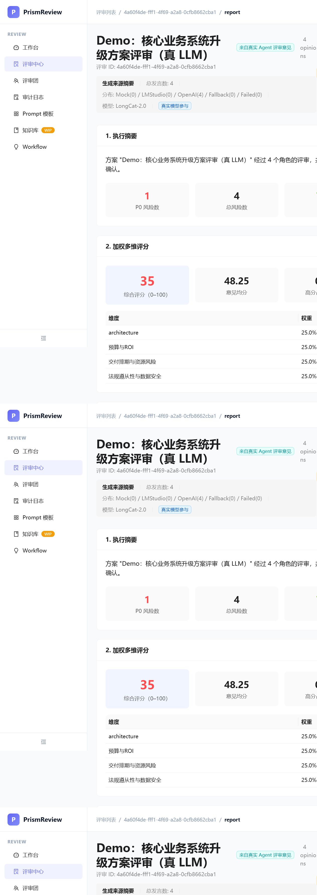
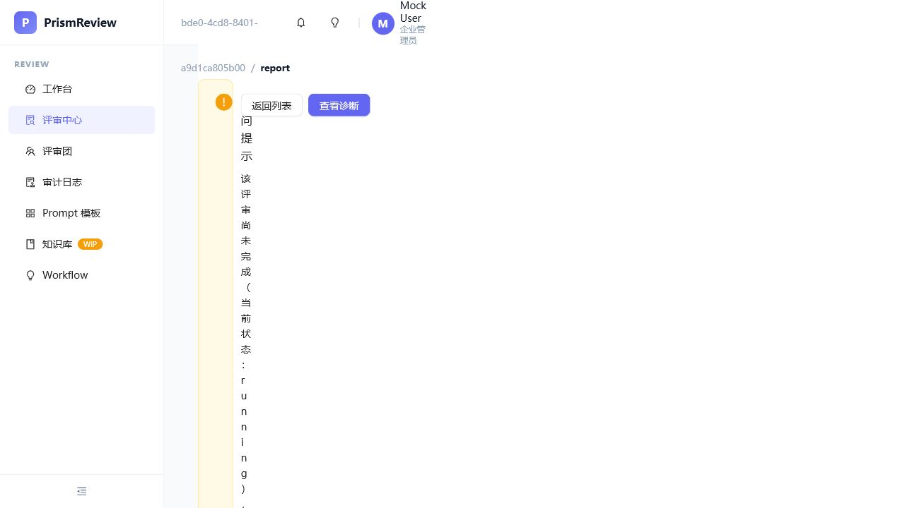

# PrismReview

> **多 Agent 智能评审中枢** —— 让一群"专家 Agent"为你的方案多轮辩论，由 AI Moderator 收敛出一份**可量化、可溯源、可审计**的正式评审报告。

<p align="center">
  <a href="https://github.com/feather100/PrismReview/actions/workflows/ci.yml"></a>
  <a href="LICENSE"></a>
  <a href="https://www.typescriptlang.org/"></a>
  
  <a href="docs/roadmap/Sprint_9.0_Product_Roadmap_Reset.md"></a>
  <a href="CONTRIBUTING.md"></a>
</p>

<p align="center">
  <b>默认全 mock · 零 API Key · 30 秒跑通 demo · 真 LLM（LongCat / LM Studio）一行 env 接入</b>
</p>

---

## 📑 目录

- [🌟 这是什么](#-这是什么)
- [🖼️ 效果预览](#️-效果预览)
- [✨ 核心特性](#-核心特性)
- [🏗️ 架构](#️-架构)
- [🚀 快速开始](#-快速开始)
- [🎬 Demo 路线](#-demo-路线)
- [🤔 为什么这样做（设计思路）](#-为什么这样做设计思路)
- [⚖️ 与其他方案对比](#️-与其他方案对比)
- [🧪 质量保障](#-质量保障)
- [📚 文档索引](#-文档索引)
- [🗺️ 路线图](#️-路线图)
- [🤝 贡献](#-贡献)
- [📄 许可证](#-许可证)

---

## 🌟 这是什么

**PrismReview** 是一个**多 Agent 智能评审中枢**：把一份企业方案 / 架构设计 / 需求文档丢进去，多个专家 Agent 会**多轮辩论**，由 AI **Moderator** 收敛出一份**可量化、可溯源、可审计**的正式评审报告。默认全 mock，**零 API Key 即可 30 秒跑通 demo**。

把一份企业方案、架构设计或需求文档丢给 PrismReview，它会：

1. **诊断**方案类型，推荐一组评审专家（CTO / CFO / PMO / Compliance / 用户代言人 …）；
2. 让多位 **Reviewer Agent** 在 `round-1` 并行给出结构化意见（观察与判断分离，`score` 与 `confidenceScore` 语义分离）；
3. 进入 **多轮辩论（Multi-Round Debate）**，由 **Moderator**（mock 或真 LLM）判定继续 / 扩容 / 转人工 / 收敛 / 强停；
4. 用 **4 种预设 workflow**（企业 / 代码审查 / 科研 / 论文）驱动不同评分权重与轮次策略；
5. **可升级辩论**（扩容评审面板）+ **风险分级人工门**（高风险低置信度 → HITL）；
6. 产出带 **加权多维评分 + 段落锚点（passageRefs）+ 来源可溯源 + Markdown 导出** 的正式评审报告。

整套编排跑在一条**自研状态机脊柱**上：显式 9 值状态机 + checkpoint/resume + 条件路由（由 `routeAfterSummarized()` 等显式方法驱动，非通用图遍历）+ HITL 中断恢复。**默认全 mock，零 API Key 即可一键把 demo 跑通。**

## 🖼️ 效果预览

<p align="center">
  
  <br/><em>企业评审报告：加权评分卡 + 段落锚点跳转（Sprint 11.0 新 UI）</em>
</p>

<p align="center">
  
  <br/><em>科研评审（research 模式）：多轮辩论 + 扩容 + 风险门 → 终态报告</em>
</p>

> **Sprint 11.0（Phase 3）已完成**：T1–T12 全部落地（意见生命周期 / 收敛信号 / 评分纪律 / 观察-判断分离 / 按动作降级 / 成本硬闸 / 可升级辩论 / 风险分级 HITL / 段落锚点 / 校准 / 会话隔离 / 滚动辩论上下文），真 LLM Demo（LongCat）全链路跑通。

---

## ✨ 核心特性

| 特性 | 说明 |
|------|------|
| 🗣️ **多轮辩论 Multi-Round Debate** | 多个专家 Agent 跨轮次交锋，由 Moderator 逼近共识，而非一次性问答。 |
| 🕸️ **状态机编排脊柱 State-Machine Spine** | 9 值状态机 + checkpoint/resume + 条件路由（显式 `route*` 方法驱动），崩了能从最近节点续跑。 |
| 🤖 **真 LLM Moderator（env-gated）** | 支持 LongCat-2.0 / LM Studio / OpenAI 兼容协议；失败自动降级 mock。 |
| 🔐 **加密的 Provider Key 管理** | AES-256-GCM 静态加密；密钥绝不落日志、绝不返回前端；UI 掩码 `sk-L••••5678`。 |
| 🛠️ **Provider 管理后台** | `/admin` 下的 LLM Provider 运行时 CRUD；带延迟的连接测试；一键启用/禁用。 |
| 🚀 **配置向导 Setup-Wizard** | 3 步完成首次配置（选择 Provider → 配置 → 测试连接）。 |
| 🔒 **RBAC + 审计** | 4 级平台角色（super_admin / enterprise_admin / department_admin / user）+ 全链路审计日志。 |
| 📊 **加权多维评分** | 4 种预设 workflow 驱动不同维度权重；评分快照落库可审计。 |
| 🧠 **蒸馏式 Memory** | Reviewer / Project 蒸馏 profile（非聊天历史）+ 多轮 rolling summary 压缩。 |
| 📝 **版本化 Prompt** | 4 层组装（base/task/context/format）+ 版本注册表 + 回滚。 |
| 📄 **Markdown 导出** | 正式评审报告一键导出，含评分小节。 |
| 🔍 **来源可观测 Provenance** | `providerSummary` 五态来源追踪：`mock / lmstudio / openai_compatible / fallback_mock / failed`。 |
| 🛡️ **硬闸兜底 Hard-Gate** | `max_rounds` / `max_turns_per_reviewer` 收敛硬闸，杜绝无限讨论。 |
| 🧹 **内存安全** | 终态自动清理运行时状态；HITL 超时兜底（120s 自动恢复）。 |
| 🧬 **意见生命周期 + 同题去重（T1）** | `candidate → challenged → accepted / rejected / downgraded` 状态机；同题去重 + 审计。 |
| 🎯 **收敛三选一信号（T2）** | 全员 AGREE / no-new-arguments / maxRounds 硬闸，显式判定收敛，杜绝"聊不完"。 |
| 📏 **评分纪律 / 通胀检测（T3）** | 默认锚定分 + 高分占比上限，越限触发 `inflationWarning`。 |
| ⚖️ **观察-判断分离（T4）** | `confidenceScore`（评审员自评）与 `score`（Moderator 评分 pass）语义分离，聚合时 score 优先。 |
| 🛟 **按动作降级 + fail-closed（T5）** | provider 按动作降级；外部调用统一策略，失败闭锁不静默。 |
| 💰 **成本硬闸（T6）** | 单评审成本上限；超限强制收敛产出报告（不 abort）。 |
| 🚀 **可升级辩论（T7）** | 未收敛自动扩容评审面板（+2 角色）再辩一轮；扩容用尽转人工。 |
| 🚦 **风险分级 HITL（T8）** | 高风险 + 低置信度意见必过人工门；resume = 人工放行 → 收敛交付报告。 |
| 📌 **段落级锚点（T9）** | 每条意见带 `passageId` + `passageRefs` 摘录，报告一键跳转原文段落。 |
| 🎚️ **评分校准对照（T10）** | AI vs 人工盲评分对照 + 标记，支撑评分可信度白皮书。 |
| 🔒 **会话隔离（T11）** | 并发评审互不串扰（并发回归测试覆盖）。 |
| 🧠 **滚动辩论上下文（T12）** | 只加载他人历史意见 + 滚动窗口，防自说自话 / 上下文爆炸。 |

---

## 🏗️ 架构

```
                         ┌──────────────────────────────────┐
       Browser ───────▶ │  apps/web   (Next.js 14)          │
                         │  React 18 + TypeScript            │
                         └───────────────┬──────────────────┘
                                         │  REST / SSE
                                         ▼
                         ┌──────────────────────────────────┐
                         │  apps/api   (NestJS 10)            │
                         │  ┌────────────────────────────┐  │
                         │  │  ReviewOrchestrator         │  │  ← 状态机编排脊柱（显式 route* 方法驱动，非通用图遍历）
                         │  │   · 9-state machine         │  │
                         │  │   · checkpoint / resume      │  │
                         │  │   · HITL interrupt/resume    │  │
                         │  │   · Mock / Llm Moderator     │  │
                         │  └─────────────┬──────────────┘  │
                         │  ModelAdapter (P2)  · WorkflowRegistry (P5) │
                         │  ScoringService (P5) · ReportingService (P5) │
                         │  PromptService (P3) · MemoryService (P3)    │
                         │  ToolRegistry (P4) · AuditInterceptor       │
                         │  PermissionsGuard (RBAC, Sprint 5.0)        │
                         └──────────────────┬───────────────┘
                                            │  providerSource
                    ┌───────────────────────┼───────────────────────┐
                    ▼                       ▼                       ▼
              [ mock ]            [ LM Studio ]          [ LongCat-2.0 ]
              (default)           (dev-only ≤3)          (env-gated)
                                                     [ OpenAI-compatible ]

   ── Infra (docker compose) ───────────────────────────────────────────────
   PostgreSQL 16  ·  Redis 7  ·  MinIO     （checkpoints / artifacts / cache）
```

> 模块化单体（modular monolith），不拆微服务。当前所有编排在 `apps/api` 进程内完成（~8,100 LOC）；`AgentRuntime` 独立 worker 进程抽取列入 P6 规划，接口已预留。

> **`apps/worker/`（Python Celery）当前为 P6 预留的骨架代码，与 `apps/api` 零接线，不参与运行。** 详细说明见 [`apps/worker/README.md`](apps/worker/README.md)。`apps/api/package.json` 中的 `bullmq` / `@nestjs/bullmq` 死依赖已移除，运行时队列由 `queue.service.ts` 内存实现承接（P6 接线时再引入 broker）。

---

## 🚀 快速开始

### 前置条件

- **Docker Desktop**（拉起 PostgreSQL / Redis / MinIO）
- **Node.js 22 LTS**（引擎要求 `>= 20`，22 已验证）
- **pnpm 9**（`corepack enable` 或 `npm i -g pnpm@9`）

### 30 秒起

```bash
# 1. 拉起基础设施（postgres / redis / minio）
docker compose up -d

# 2. 安装依赖并初始化数据库
pnpm install
cd apps/api && pnpm prisma:generate && pnpm prisma:migrate deploy && pnpm prisma:seed && cd ../..

# 3. 并行启动 web + api
pnpm dev
```

打开 **http://localhost:3000**，点击 **"创建 Mock 演示评审"**，一条完整的 `create → diagnose → multi-round debate → report` 链路就跑通了，全程纯 mock、不需要任何 API Key。不点击也行，用脚本一键：

```bash
node scripts/setup-demo-review.js          # 纯 mock，最快验证
node scripts/setup-demo-review.js --with-runner   # 额外落库 opinions，Report 报告更丰富
```

> 完整链路自愈可被 `node scripts/smoke-runtime.js` 验证。详见 [docs/demo/MVP_Demo_Runbook.md](docs/demo/MVP_Demo_Runbook.md)。

### 真实 LLM 模式（可选，显式 env 启用）

```bash
cd apps/api
ALLOW_EXTERNAL_MODEL_CALLS=true MODEL_PROVIDER=longcat \
  MODEL_BASE_URL=https://api.longcat.chat/openai/v1 \
  MODEL_NAME=LongCat-2.0 MODEL_API_KEY=<your-key> node dist/main.js
```

支持的 provider：`longcat` / `lmstudio`（本地）/ `openai_compatible`。**Moderator 也可切换为真 LLM**（追加 `MODERATOR_PROVIDER=llm`），失败自动降级 mock。默认始终 mock，默认安全。

---

## 🎬 Demo 路线

两种开箱即用的演示路径（均由 `scripts/setup-demo-review.js` 驱动，无需手写请求）：

| 路线 | 命令 | 说明 | Report 来源 |
|------|------|------|-------------|
| **Route A · 纯 mock** | `node scripts/setup-demo-review.js` | 默认 mock provider，零 Key 即可跑通主链路 | `mock` |
| **Route B · runner + DB** | `node scripts/setup-demo-review.js --with-runner` | 额外调用 `run-agent-turns-for-review.js` 落库 opinions | `db_opinions` |

脚本会打印 Review ID 与可访问链接：

```
  Diagnosis:   http://localhost:3000/reviews/{id}
  Meeting:     http://localhost:3000/reviews/{id}/meeting
  Report:      http://localhost:3000/reviews/{id}/report
  SSE Stream:  http://localhost:4000/api/reviews/{id}/meeting/stream
  Route:       A (pure mock) | B (runner + DB opinions)
```

### 真实 LLM 模式（产品化）

PrismReview 支持 **per-review provider 覆盖**：每份评审可以独立选择

- `mock`（默认 — 零成本，零配置，评审由内置规则生成）
- `lmstudio`（本地 LM Studio，默认 `http://127.0.0.1:1234/v1`）
- `openai_compatible`（云端兼容端点，如 **LongCat-2.0**）

**创建评审时**在表单里直接选择 provider 即可，无需改环境变量。选 LongCat / LM Studio 评审会真正调用模型发言；选 mock 则确定性兜底。api-key 存入 DB，**不落日志、不返回前端**。

手动启动全局真实 LLM（所有新评审默认走 LLM）：

```bash
cd apps/api
ALLOW_EXTERNAL_MODEL_CALLS=true \
MODEL_PROVIDER=openai_compatible \
MODEL_BASE_URL=https://api.longcat.chat/openai/v1 \
MODEL_NAME=LongCat-2.0 \
MODEL_API_KEY=<your-key> \
MODERATOR_PROVIDER=llm \
node dist/main.js
```

支持的 provider：`mock` / `lmstudio`（本地，Key 可选）/ `openai_compatible`（任意 OpenAI 兼容端点）。

真实 Moderator：追加 `MODERATOR_PROVIDER=llm`（需 `MODERATOR_PROVIDER=llm` + `ALLOW_EXTERNAL_MODEL_CALLS=true`）。失败自动降级 mock，主流程不中断。

### 一键真 LLM Demo（Sprint 11.0，LongCat）

```bash
DEMO_MODE=enterprise node scripts/demo-run.js   # 企业评审（更快收敛）
DEMO_MODE=research   node scripts/demo-run.js   # 科研评审（多轮 + 扩容 + 风险门，演示 T7/T8）
```

脚本自动拉起 API(:4000) + Web(:3000)，走通「创建评审 → 诊断 → 选角色 → 真 LLM 多轮 → 中断自动 resume → 报告」；结束后 `node scripts/demo-run.js --cleanup` 清理服务进程。LongCat provider 已预置在 DB，LLM 调用约 20–30s/轮。

---

## 🤔 为什么这样做（设计思路）

> 以下节选自 [docs/roadmap/Sprint_9.0_Product_Roadmap_Reset.md](docs/roadmap/Sprint_9.0_Product_Roadmap_Reset.md) §2 三项承重决策。

- **为什么选 9 值状态机而不是自由 DAG？** 多轮辩论的核心难题是"收敛判定"。自由 DAG 一旦加入 HITL 中断 / Moderator 条件路由 / checkpoint resume，路径组合会爆炸、很难审计哪条分支做了什么决策。9 值状态机把全部生命周期收缩成一张**可验证、可序列化、可回放**的显式图，配合 `postgres-checkpointer` 就能在任何节点崩溃后从 checkpoint 续跑，而不是整场重跑。
- **为什么默认全 mock？** PrismReview 是**编排层**而不是模型层。评审的质量上限取决于模型，但编排的可靠性取决于工程。把模型调用抽到 `provider-factory` + `model-adapter` 两个接口后面，所有编排逻辑（状态机 / Moderator / Memory / 评分）就能在**零 Key、零成本**的前提下快速迭代与测试。真 LLM 一行 env 就能接。
- **为什么禁止 A2A（Agent 间直接互联）？** 如果让专家 Agent 彼此直接聊天，Moderator 无法审计每一步决策，收敛也无法保证。本项目采用**"Moderator 中心化"**：专家只向 Moderator 提交结构化 opinion，由 Moderator（mock 或真 LLM）挑人辩论、框定冲突、提出终止。硬闸（`max_rounds`、`max_turns_per_reviewer`）由代码强制、LLM 不可覆盖。

### 与现有方案对比

| 维度 | PrismReview | ChatGPT 直接问 | 传统评审会议 | CrewAI / LangGraph |
|------|-------------|----------------|--------------|---------------------|
| 评审模式 | 多 Agent **多轮辩论** + Moderator 收敛 | 单模型、单轮问答 | 真人多轮、高成本 | 可编排，但需自建 Moderator |
| 产出 | 结构化报告 + 加权评分 + Markdown 导出 | 自由文本，难量化 | 会议纪要，风格因人而异 | 需自行组装 |
| 溯源 | 每条意见溯源到 Agent + 模型 + provider 类型 | 无 | 难 | 框架依赖 |
| 成本 | 默认零（mock） | 按 token 计费 | 人力 $$$ | 需自建可观测 |
| 停机恢复 | checkpoint → 任意节点续跑 | 无 | 重开一场 | LangGraph 支持，CrewAI 弱 |
| 工程定位 | 编排脊柱（own orchestration） | 端点 | 流程 | 框架 |

---

## 🧪 质量保障

每次 PR 自动运行（见 [`.github/workflows/ci.yml`](.github/workflows/ci.yml)）：

- ✅ **TypeScript 类型检查**（`apps/api` + `apps/web`，0 error 门禁）
- ✅ **211 项 Jest 单元测试**（Sprint 11.0：编排状态机、Moderator 决策链、幂等、硬闸、评分、会话隔离等）
- ✅ **e2e 冒烟**：`node scripts/e2e-smoke.js`（API 启动 5/5）+ `node scripts/e2e-verify-sprint-10.1.js`（5/5）
- ✅ **数据库迁移**：19/19 已入库；CI 用 `prisma migrate deploy`（见 [Deployment_Migration_Checklist](docs/coordination/Deployment_Migration_Checklist.md)）
- ✅ **冒烟脚本**（16 个 `scripts/*.js` 验证主链路自愈）
- ✅ **密钥扫描**（提交前检测硬编码密钥）

> 2026-07-16 完成一轮独立代码审查（[报告](docs/coordination/Review_2026-07-16_Report.md)）：修复 SSRF 防护与 Provider 白名单、补全 RBAC 注解、HITL 崩溃安全恢复、清理死依赖，所有 P2 风险已闭环。

---

## 📚 文档索引

| 文档 | 内容 |
|------|------|
| [docs/ARCHITECTURE.md](docs/ARCHITECTURE.md) | 系统架构、编排脊柱、Moderator、数据模型、观测性 |
| [docs/roadmap/Sprint_9.0_Product_Roadmap_Reset.md](docs/roadmap/Sprint_9.0_Product_Roadmap_Reset.md) | 架构决策锁定（三项承重决策）+ P0–P6 路线图 |
| [docs/coordination/ACTIVE_SPRINT.md](docs/coordination/ACTIVE_SPRINT.md) | 当前 Sprint 与 Gate 记录 |
| [docs/coordination/Sprint_11.0_Summary.md](docs/coordination/Sprint_11.0_Summary.md) | Sprint 11.0 总结：调研 → 评审 → Phase 3 六项 P0 落地 |
| [docs/coordination/Handoff_20260804.md](docs/coordination/Handoff_20260804.md) | 交接文档：当前状态 + 遗留项 + 环境备忘 |
| [docs/coordination/Deployment_Migration_Checklist.md](docs/coordination/Deployment_Migration_Checklist.md) | 19 个迁移总表 + 执行/验证/风险清单 |
| [docs/research/phase3-task-list-20260803.md](docs/research/phase3-task-list-20260803.md) | Phase 3 任务清单（T1–T14）与验收口径 |
| [docs/coordination/Sprint_6.0_Full_Stack_Review_Report.md](docs/coordination/Sprint_6.0_Full_Stack_Review_Report.md) | 全栈审查报告（205 测试场景 + P1/P2 修复） |
| [docs/demo/MVP_Demo_Runbook.md](docs/demo/MVP_Demo_Runbook.md) | MVP Demo 操作手册 |
| [docs/coordination/AGENT_COORDINATION_PROTOCOL.md](docs/coordination/AGENT_COORDINATION_PROTOCOL.md) | Agent 协作协议（标准 Gate / 快速 Gate） |
| [CONTRIBUTING.md](CONTRIBUTING.md) | 贡献指南与开发环境 |

---

## 🗺️ 路线图进度

| 阶段 | 范围 | 状态 |
|------|------|------|
| **P0** | MVP mock demo：1 轮 + 报告 + Markdown 导出 | ✅ 完成 |
| **P1** | 编排脊柱：9 状态机 + checkpoint + 幂等 + opinion schema + mock Moderator + round-2 mock debater | ✅ 完成（Sprint 9.0–9.5b） |
| **P2** | Model Adapter 泛化 + 真 LLM 路由（LongCat / LM Studio / OpenAI 兼容）+ 质量评测 | ✅ 完成（Sprint 2.1 / 2.2 / 4.0） |
| **P3** | 版本化 Prompt 注册表 + Reviewer/Project Memory（蒸馏 profile）+ Rolling Summary | ✅ 完成（Sprint 5.1） |
| **P4** | MCP 工具层（预留）+ HITL 中断/恢复 + 真 LLM Moderator + 人类回合覆盖 | ✅ 完成（Sprint 5.2） |
| **P5** | 4 种预设 workflow + 加权多维评分 + 报告生成器 + 内存安全加固 | ✅ 完成（Sprint 5.3） |
| **Sprint 11.0 · Phase 3** | 阶段 3 壁垒：生命周期 / 收敛信号 / 评分纪律 / 评分分离 / 降级 / 成本 / 升级辩论 / 风险门 / 段落锚点 / 校准 / 并发隔离 / 辩论上下文（T1–T12）+ 真 LLM Demo + CI | ✅ 完成（2026-08-04） |
| **P6** | 规模化 + 生产硬化：AgentRuntime worker 进程 + OTel 全链路 + 成本看板 + 多租户；T13/T14（确定性-语义分层 / 复评闭环） | 🔜 下一阶段 |

---

## 🤝 贡献

欢迎 Issue / PR。开发环境搭建、分支与提交约定、标准 Gate 流程见 [CONTRIBUTING.md](CONTRIBUTING.md)。

---

## 📄 许可证

[MIT](LICENSE) © 2026 feather100。

觉得 PrismReview 有意思？欢迎 **Star ⭐** 持续关注，或直接到 [Discussions](https://github.com/feather100/PrismReview/discussions) 打个招呼 / 提出想要的功能。

---

### 推荐 GitHub Topics

如果你正准备分享这个项目，把这些 topic 加到仓库 About 里能显著提升搜索曝光：`multi-agent`, `code-review`, `llm`, `nestjs`, `nextjs`, `ai-orchestration`, `debate`, `rag`。
