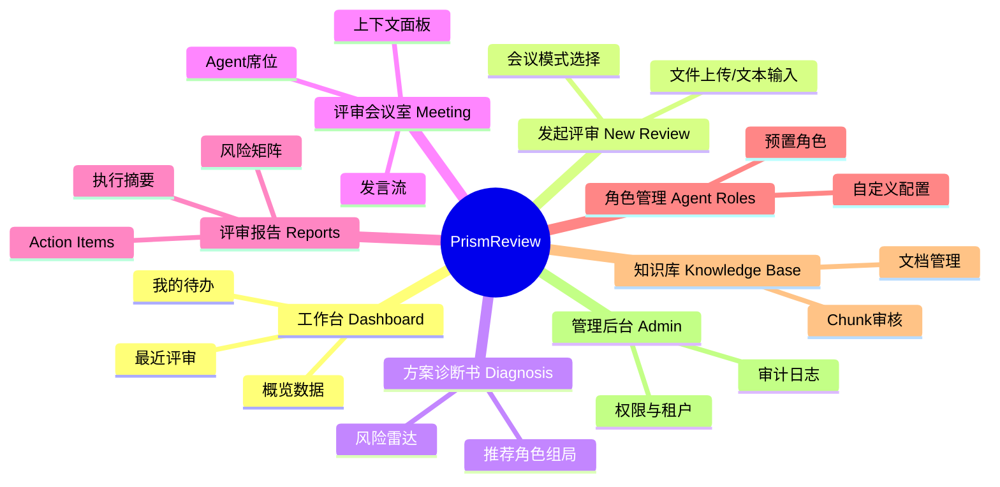

# PrismReview UI/UX Sprint 0 - 架构与低保真设计

> [!NOTE]
> 基于前置设计包，本阶段输出信息架构、核心流程的低保真原型及设计系统方向，暂未涉及高保真 UI。

## 1. 信息架构图 (Information Architecture)



## 2. 核心流程原型与 P0 低保真线框

### 2.1 核心主干流程


### 2.2 [P0] 发起评审 (New Review)

**设计意图**：降低输入门槛，状态明确。

```text
+-----------------------------------------------------------------------+
| 💠 PrismReview     工作台   [ 发起评审 ]   历史   知识库   角色中心   |
+-----------------------------------------------------------------------+
|                                                                       |
|  发起新评审 (New Review)                                              |
|                                                                       |
|  1. 输入方案内容                                                      |
|  +-----------------------------------------------------------------+  |
|  |  📄 拖拽文档到此处，或 点击上传 (支持 PDF, DOCX, MD)              |  |
|  |  ------------------------- OR -------------------------         |  |
|  |  [ 切换至文本粘贴模式 ]                                           |  |
|  +-----------------------------------------------------------------+  |
|                                                                       |
|  2. 一句话目标描述                                                    |
|  +-----------------------------------------------------------------+  |
|  | 例如：评估新一代网关架构的扩展性和安全合规风险                    |  |
|  +-----------------------------------------------------------------+  |
|                                                                       |
|  3. 评审模式设置                                                      |
|  (o) 轮流发言 (Round-Robin)  - 稳定可控，适合常规评审                 |
|  ( ) 自由辩论 (Free Debate)  - 交叉视角，适合开放探索                 |
|                                                                       |
|                     [ 生成方案诊断书 (Generate Diagnosis) ]           |
|                                                                       |
+-----------------------------------------------------------------------+
```

### 2.3 [P0] 方案诊断书 (Diagnostic Report)

**设计意图**：展现“智能感”，可视化风险维度，让用户调整和确认 Agent 团队。

```text
+-----------------------------------------------------------------------+
| 💠 方案诊断书: 新一代网关架构评审                                     |
+-----------------------------------------------------------------------+
|                                                                       |
|  [ 方案摘要 ]                        |  [ 推荐评审团 (AI Committee) ] |
|  系统自动提取的方案核心内容摘要...   |                                |
|  标签: 架构设计 / 微服务 / 高并发    |  👤 架构师 (权重: 30%)         |
|                                      |      推荐理由: 涉高并发架构... |
|  [ 风险分布雷达图 (Risk Radar) ]     |      [x] 移除                  |
|         性能                         |  ---------------------------   |
|      /        \                      |  👤 安全合规 (权重: 30%)       |
|  可用         安全                   |      推荐理由: 涉及数据出境... |
|      \        /                      |      [x] 移除                  |
|         成本                         |  ---------------------------   |
|                                      |  + [ 添加其他角色 (Add Role) ] |
|  诊断置信度: 85%                     |                                |
|                                      |                                |
|                     [ 确认组局并开始评审 (Start Review) ]             |
+-----------------------------------------------------------------------+
```

### 2.4 [P0] 评审会议室 (Meeting Room)

**设计意图**：卡片式信息分层，弱化聊天属性，强调“多角色协作”和“进度可控”。

```text
+-----------------------------------------------------------------------+
| 🔴 进行中 | 新一代网关架构评审 | 模式: 轮流发言 | 进度: 2/3 角色完成    |
+-----------------------------------------------------------------------+
| [Agent 席位] | [实时发言流]                          | [上下文与干预] |
|              |                                       |                |
| 👤 架构师    | 👤 架构师 (置信度: 高)                | 📌 当前方案摘要|
| 🟢 已完成    | 风险: 🔴 高风险  维度: 性能           | ...            |
|              | 意见: 建议使用 Redis 集群代替单机...  |                |
| 👤 安全合规  | 证据引用: [2] 知识库:内部架构规范.md  | ✋ 人机干预    |
| 🗣️ 发言中... |                                       | [ 暂停会议 ]   |
|              | ------------------------------------- | [ 注入新条件 ] |
| 👤 PMO       | 👤 安全合规 (思考中...)               |                |
| ⏳ 排队中    | 正在检索 [隐私数据合规标准]...        |                |
|              |                                       |                |
|              |                                       | [ 强制结束 ]   |
+-----------------------------------------------------------------------+
```

### 2.5 [P0] 评审报告 (Report)

**设计意图**：从“长文结论”收敛到“决策辅助”，Action 项最先暴露。

```text
+-----------------------------------------------------------------------+
| 📊 评审报告: 新一代网关架构                          [ 导出 PDF/MD ]  |
+-----------------------------------------------------------------------+
|                                                                       |
|  [ 执行摘要 & 总体结论 ]                                              |
|  评级: ⚠️ 有条件通过 (Conditionally Approved)                         |
|  摘要说明系统识别出的最大瓶颈和阻碍...                                |
|                                                                       |
|  [ Action Items (待办事项) ]                                          |
|  1. [待分配] 补充容灾演练方案 (来源: 架构师)                          |
|  2. [待分配] 确认数据加密中间件版本 (来源: 安全合规)                  |
|                                                                       |
|  [ 风险矩阵 (Risk Matrix) ]       |  [ 分维度详评 (Detailed) ]        |
|  (高概率/高影响): 容灾策略缺失    |  - 架构设计维度...                |
|  (低概率/高影响): 秘钥泄漏风险    |  - 安全合规维度...                |
|                                   |  - 成本管理维度...                |
|                                                                       |
|  ⚠️ 待人工确认项 (低置信度意见):                                      |
|  - PMO 提出的研发排期冲突风险 (置信度 55%)，请人工核实。              |
+-----------------------------------------------------------------------+
```

## 3. 设计系统方向 (Design System)

- **品牌隐喻 (Metaphor)**：Prism 棱镜拆解。光束经过折射，展现多维视角。
- **色彩规范 (Colors)**：
  - **主色 (Primary)**：低饱和深蓝 (Indigo) / 靛紫 (Violet)。
  - **AI 强调色 (AI Accent)**：紫青渐变 (Violet/Cyan gradient)，用于 Agent 思考状态、高光诊断结果。
  - **风险等级 (Risk Levels)**：
    - 🔴 高风险：Red (醒目且清晰)
    - 🟠 中风险：Orange
    - 🟡 低风险：Amber / Yellow
  - **中性色/背景 (Background)**：冷灰色 (Cool Gray) 或近白，保持界面冷静、专业。
- **排版 (Typography)**：现代无衬线字体 (如 Inter, Roboto, Outfit)，突出数据与结构。
- **卡片式布局 (Card-based Layout)**：
  - AI 输出必须被封装在带明确边界的卡片中，包含元数据（角色、信心指数、维度、引用），坚决避免传统 Chatbot 的对话气泡样式。
- **动效与交互 (Micro-animations)**：
  - AI 思考和检索时的微秒级渐变呼吸灯效果。
  - 生成报告时的平滑骨架屏过渡。
  - Hover 显示完整引用卡片。

## 4. Sprint 0 决策与确认 (Decisions & Confirmations)

> [!NOTE]
> 以下为 Sprint 0 Kickoff 会议中已决议的设计问题。

1. **“发起评审”环节的文档解析时序**：
   - **决议**：采用异步处理。界面上显示解析进度；允许用户离开页面，解析完成后在工作台接收通知。
2. **人机干预 (Human Intervention) 的状态打断逻辑**：
   - **决议**：不硬中止当前 Agent。将当前 turn 标记为 `interrupted_pending`，等该角色说完后，Chairman 注入新条件并触发后续流程补充。
3. **角色与知识库的权限交集验证**：
   - **决议**：在组局前通过 API 强校验并拦截。不允许在会议中出现“静默跳过”的情况。
4. **低信心意见的人工确认交互**：
   - **决议**：在“报告页”统一进行确认；同时这些意见也会流转进入“工作台待办”任务列表。
5. **Action Items 同步反馈**：
   - **决议**：MVP 保留“推送到外部”的操作按钮，但在界面上显示为 Mock/未配置 状态，作为状态流转的占位闭环。
