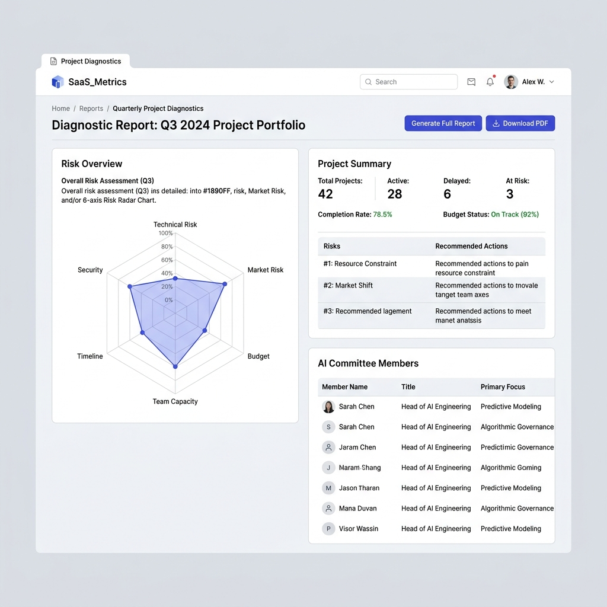
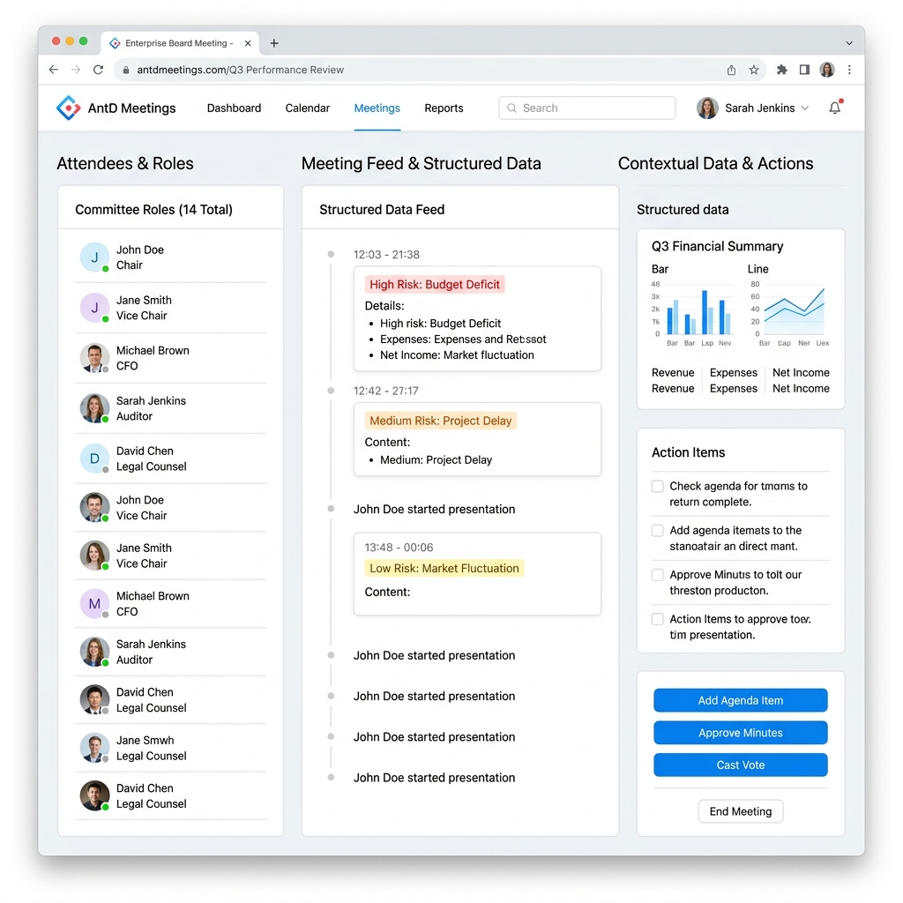
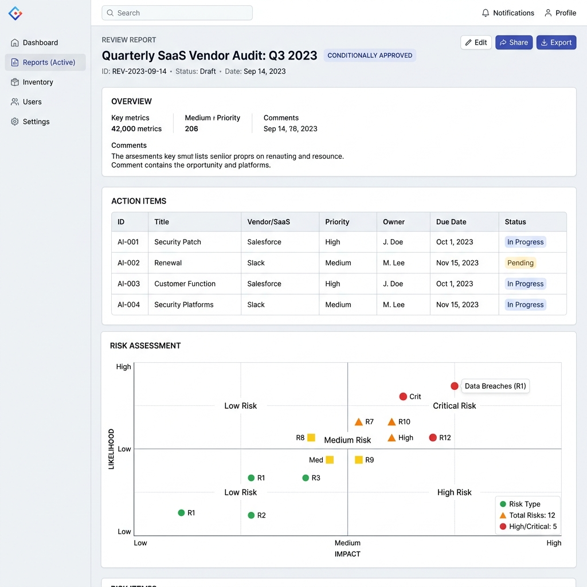

# Sprint 0.5 - 核心流程高保真 UI 探索 (B 端工业 SaaS 风格)

根据您的反馈以及众工业平台的设计规范 (Zhong Industrial Platform UI Skill)，我们对三个核心页面的高保真设计进行了重构。

**设计方向调整**：摒弃了之前偏“AI 艺术/科幻”的深色及渐变风格，全面转向严谨、轻量级 SaaS、高效的工业级平台风格。大量参考 Ant Design 式的组件语义与结构，确保界面清晰、克制、数据呈现密集且易读，符合真实的 B 端产品体验。

## 1. 方案诊断书 (Diagnostic Report)

> 采用白底和浅灰背景区隔，标准的卡片式容器。包含风险雷达图、项目摘要及清晰的评审人员列表结构。

## 2. 评审会议室 (Meeting Room)

> 回归专业 SaaS 的三栏结构布局，去掉了浮夸的聊天气泡，代之以结构化的数据流列表、清晰的状态标签（Tag）以及严谨的上下文操作面板。

## 3. 评审报告页 (Report Page)

> 极致克制的报表页面，标准的 HTML 数据表格结构，搭配 2x2 的风险矩阵图，重点强调信息的可扫描性和结论性（Conditionally Approved 标签）。

