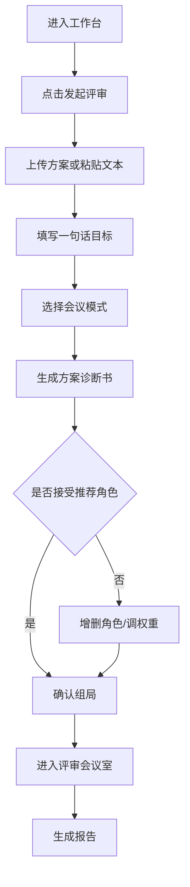
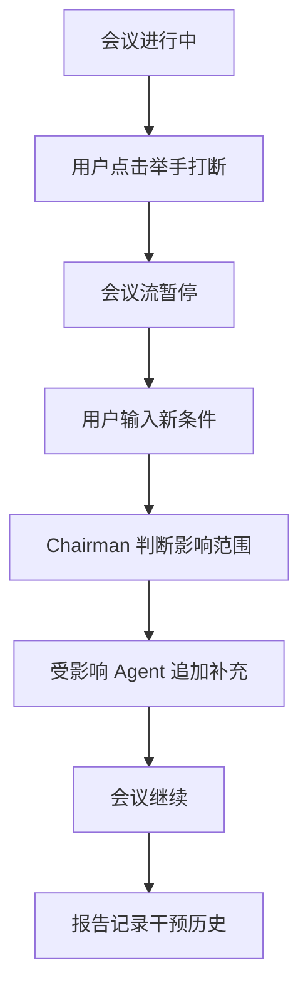
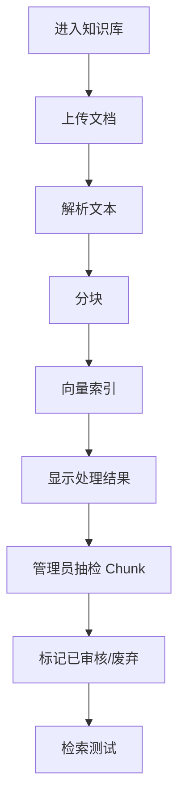

# 02. Information Architecture & User Flows

## 1. 顶层导航

```text
PrismReview
├─ 工作台 Dashboard
├─ 发起评审 New Review
├─ 评审历史 Review History
├─ Action Items
├─ 角色中心 Agent Roles
├─ 知识库 Knowledge Base
├─ 报告中心 Reports
└─ 管理后台 Admin
   ├─ 用户与权限
   ├─ 评审标准权重
   ├─ 审计日志
   ├─ 集成配置
   └─ 使用统计
```

## 2. 页面优先级

| 优先级 | 页面 | 说明 |
|---|---|---|
| P0 | 工作台 | 最近评审、待办、快捷发起 |
| P0 | 发起评审 | 上传/粘贴、目标、会议模式 |
| P0 | 方案诊断书 | 标签、风险维度、推荐角色、调整 |
| P0 | 评审会议室 | 实时发言流、角色状态、人机干预 |
| P0 | 评审报告 | 风险矩阵、Action Items、引用、反馈 |
| P0 | 角色管理 | 角色列表、详情、版本、知识挂载 |
| P0 | 知识库管理 | 文档列表、处理状态、检索测试、Chunk 审核 |
| P0 | 权限管理 | 租户/部门/用户/权限矩阵 |
| P1 | 历史对比 | 相似方案、差异分析 |
| P1 | Action 看板 | 状态流转、负责人、外部推送 |
| P1 | 数据仪表盘 | 使用趋势、采纳率、角色表现 |

## 3. 核心用户旅程

### 3.1 发起评审旅程



### 3.2 人机协同干预旅程



### 3.3 知识库维护旅程



## 4. 关键页面信息结构

### 4.1 工作台 Dashboard

- 顶部：快捷发起评审、全局搜索、通知。
- 概览卡片：本月评审数、待处理 Action、平均耗时、建议采纳率。
- 最近评审：状态、模式、角色数、风险等级、更新时间。
- 我的待办：Action Items、待人工确认低信心意见、待审核知识条目。

### 4.2 发起评审

- 输入区域：上传文件、粘贴文本、目标描述。
- 设置区域：会议模式、权重模板、快速模式。
- 校验提示：文件格式、大小、文本长度、可用角色数。
- 主按钮：生成评审局。

### 4.3 方案诊断书

- 左栏：方案摘要、领域标签、主要风险维度、相似历史评审。
- 中栏：风险雷达图、建议会议模式、诊断置信度。
- 右栏：推荐 Agent 卡片，包含邀请理由、关注维度、权重。
- 操作：接受推荐、添加角色、移除角色、调整权重、开始评审。

### 4.4 评审会议室

- 顶部状态：评审名称、会议模式、当前阶段、进度、连接状态。
- 左侧角色席位：头像/代号、状态、发言次数、超时/失败状态。
- 中间发言流：按时间展示 Agent 输出、引用、风险标签、信心指数。
- 右侧上下文面板：方案摘要、知识引用、临时条件、待确认事项。
- 底部操作：举手打断、暂停、切换模式、终止并生成报告。

### 4.5 评审报告

六章结构：

1. 执行摘要。
2. 方案整体评级。
3. 分维度详评。
4. 风险矩阵。
5. Action Items。
6. 低信心意见与人工确认建议。

辅助功能：导出、分享、反馈、推送 Action、查看原始发言与证据链。

## 5. 设计状态定义

| 对象 | 状态 |
|---|---|
| Review | draft / diagnosing / ready / running / interrupted / summarizing / completed / failed / archived |
| Agent Run | queued / retrieving / thinking / speaking / completed / timeout / failed / skipped |
| Document | uploading / parsing / chunking / indexing / ready / parse_failed / index_failed |
| Chunk | pending_review / approved / rejected / deprecated |
| Action Item | open / assigned / in_progress / blocked / done / canceled |

## 6. 空状态与异常态

- 无可用角色：引导管理员启用或创建角色。
- 诊断失败：降级为手动组局。
- 文档解析失败：允许纯文本目标继续诊断，同时提示重新上传。
- Agent 超时：保留部分输出，继续下一个 Agent，报告中标注。
- 网络断连：顶部 banner + 自动重连 + 补齐断连期间输出。
- 权限不足：展示可申请访问入口，不泄漏内容。
